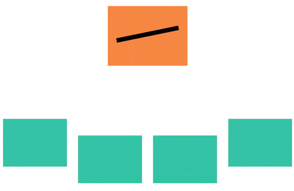
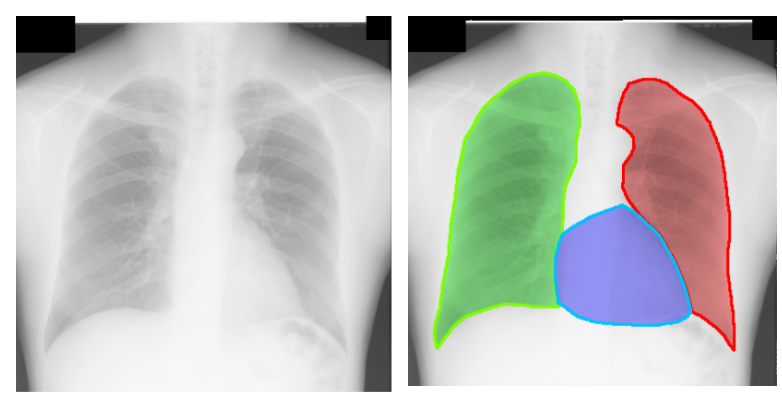
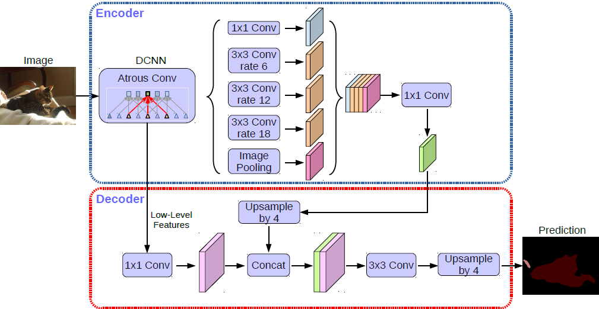
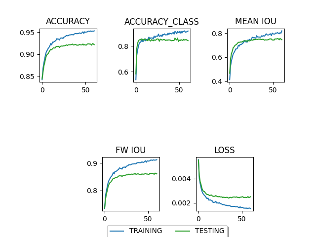

{: id="anim1"}

### Overview

Image segmentation is a commonly used technique to partition an image and generate pixel-wise masks for each instance. There are several interesting use cases for segmentation, ranging from medical data analysis to content-based image retrieval. 

However, is it possible to do image segmentation on data we do not have access to?
No, not now! 

Does that limit us to solve problems we care about?
Maybe, yes. 

Let us consider a scenario where top medical institutions have just learned about the novel coronavirus and intend to diagnose the illness using the chest X-ray images of symptomatic patients. Using these images, a segmentation model could be developed in order to facilitate early diagnosis. Unfortunately, this approach is not as straightforward as it sounds. We would inevitably encounter some significant bottlenecks while training the segmentation model. The most noteworthy concern would be data insufficiency due to privacy concerns where hospitals are unwilling to share sensitive patient records, besides lack of adequate computing resources. 

<!--  -->

{: id="pic1"}

Thus, the real problem lies in agglomerating all the information in a central location where the model will train. This brings us to the notion of federated learning! With federated learning, we can now take the model to the data instead of bringing the data to the model. 

- A centralized server maintains the global deep neural network model. 
- Each participating institution trains their own copy of the model using their respective datasets. 
- The central server then receives the updated model from each participant and aggregates the contributions.
- The model’s updated parameters are shared with the participants once again, as they continue their local training. 

This agreement of letting developers train the segmentation model on data they cannot have access to is the framework we have built and termed as FedSegment. 

### Approach

We simulate a federated learning architecture by adapting and training DeepLabV3+, a state-of-the-art model for image segmentation, and incorporating ResNet as the backbone for extracting feature maps. We develop a data loader for the PASCAL VOC dataset which supports partitioning of the data between our virtual clients in a non-I.I.D fashion using Dirichlet, to represent real-world, scattered data. 

The Dirichlet distribution is a density over a K dimensional vector p whose K components are positive and sum to 1. Dirichlet can support the probabilities of a K-way categorical event. In Federated Learning, we find that the K clients' sample numbers obey the Dirichlet distribution. This Latent Dirichlet Allocation (LDA) method was first proposed by Measuring the Effects of Non-Identical Data Distribution for Federated Visual Classification. This can generate nonIIDness with an unbalanced sample number in each label.

<!--  -->
{: id="anim2"}

The server sends initial weights of the model to all the clients in the beginning. The clients start training on their own subset of data and send weights to the server. The server gathers the weights from all the clients and performs aggregation on the weights. The aggregated weights are sent back to the clients and the training continues. This entire loop is called one round. Many such rounds are simulated in order to achieve a decent accuracy. 

### Implementation

<!--  -->
{: id="pic2"}

We perform image segmentation by training the Deeplabv3+ model with ResNet-101 as backbone for feature maps extraction. DeepLabv3+, extends DeepLabv3 by adding a simple yet effective decoder module to refine the segmentation results especially along object boundaries. It uses the Resnet model as a backbone and applies the depthwise separable convolution to both Atrous Spatial Pyramid Pooling and decoder modules, resulting in a faster and stronger encoder-decoder network.

We build a segmentation model on top of the open source FedML framework by training the Deeplabv3+ - Resnet 101 model on the PASCAL VOC dataset comprising 10582 augmented training images and 2857 validation images. The centralized training of Deeplabv3+ in the research paper is our reference baseline model which gives a mean Intersection-over-Union (mIoU) of 78.85%. We have achieved an mIoU of 75.57% in the federated setting. Assuming we have 4 virtual clients, we use 4 GPUs where we assign each client one GPU. By conducting several experiments, we have determined the following values for the training parameters to achieve good results: Batch Size: 10, output stride: 16, learning rate: 0.007, optimizer: SGD. We train the model for 60 rounds with 2 epochs per round. We have also enabled a functionality to save checkpoints of the best validation prediction of mIoU by implementing a saver module.  

### Experiments

### Results

| mIoU | fwIoU | Test accuracy | Test class accuracy | Loss |
|-------|--------|---------|-------|--------|
| ambrosia | gala | red delicious |     |      |
| pink lady | jazz | macintosh |      |      |
| honeycrisp | granny smith | fuji |     |     |

### Challenges

### Future Work

There are two things that we can work on:
 - Improving accuracy of the model - In addition to hyper parameter tuning, we can further try to improve on accuracy by experimenting with other aggregation methods e.g, FedMA instead of FedAvg. Also, plugging a better loss function (Dice + Focal Loss) instead of Cross-Entropy Loss may be helpful

- Integrating other popular segmentation models - We also intend to explore and incorporate alternate backbones to train the DeepLabV3+ model - such as Xception, MobileNet which have pretrained models resulting in SOTA accuracy. Currently, our approach is limited to using the ResNet backbone. We also plan on extending our current work and encompass additional segmentation models such as EfficientFCN or BlendMask under the FedSegment umbrella.

### Resources

1. https://fedml.ai/
2. https://arxiv.org/abs/2007.13518
3. https://arxiv.org/pdf/1802.02611.pdf
4. https://wandb.ai/elliebababa/fedml/runs/5ykbr3ul
5. https://github.com/jfzhang95/pytorch-deeplab-xception

